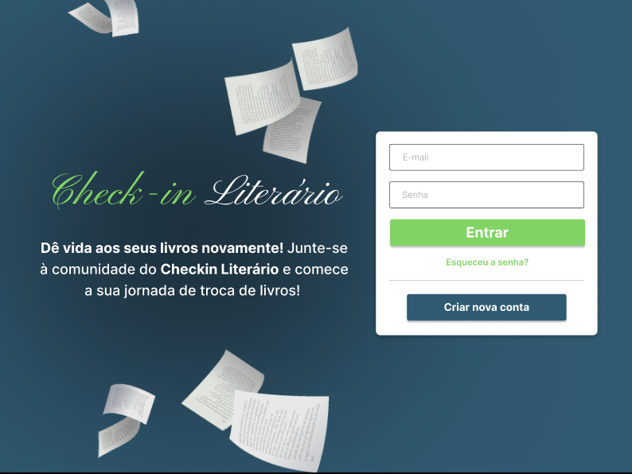

# Check-In Literário

 

## Descrição

Check-In Literário é um portal online dedicado à troca de livros entre usuários. O projeto tem como objetivo fomentar a cultura da leitura e oferecer uma plataforma segura e eficiente para a troca de livros usados. No site podemos encontrar: 
- Homepage com informações principais sobre o projeto;
- Página de login e cadastro do usuário na plataforma;
- Página de pefil do usuário, com informações sobre cadastro e solicitações de livro;
- Uma página de catálogo dos livros na plataforma;
- Página de detalhes e comentários sobre o livro;
- Página de solicitação dos livros;
- Página de Quem Somos,com um pouco sobre os fundadores do site e onde encontrá-los nas redes LinkedIn e GitHub.

Layout do projeto: 
 
https://www.figma.com/file/1OiB6BwICLu9lfjWCyiKuY/Main?type=design&node-id=0-1&mode=design&t=tbIzYXrdltT4SDfY-0

## Tecnologias usadas
- HTML
- CSS
- JavaScript 

## Colaboradores
- Bianca Viana - https://github.com/BiancaAViana
- Breno Mascarenhas - https://github.com/MascarenhasBreno
- Jeovan Delavechea - https://github.com/jeovan-delavechea
- Patricia Taha - https://github.com/patytaha123
- Taise Souza - https://github.com/TaiseSouza92
- Caio Daniel - https://github.com/Caio2a7
